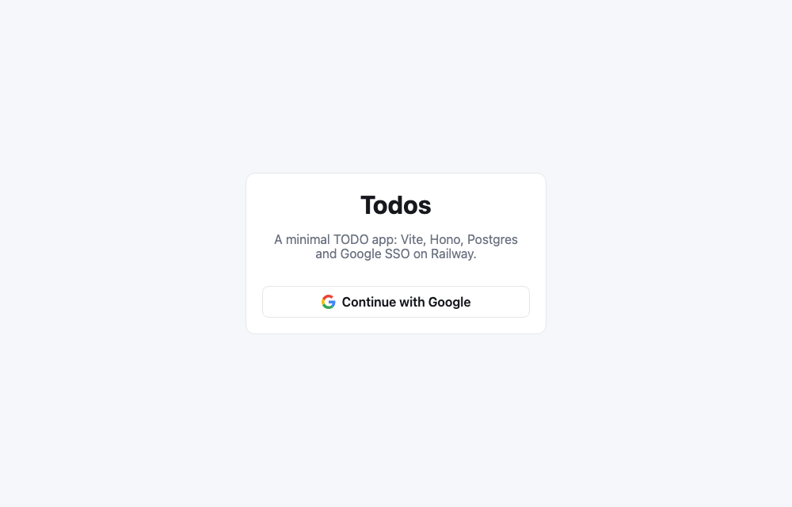
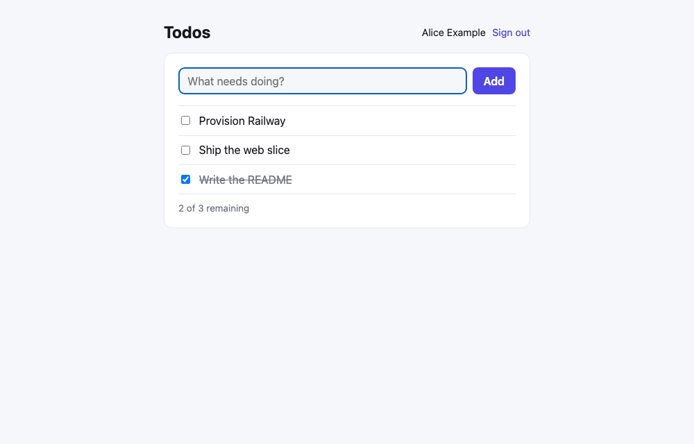

# railway-todo-app

A minimal but complete TODO application, built as a **template for new apps** on this stack:
**Vite + React** frontend, **Hono** backend, **Postgres** (Drizzle) datastore, **Google SSO**, deployed
to **Railway** with infrastructure as code and CI-gated auto-merge.

| Login                                     | Todos                                    |
| ----------------------------------------- | ---------------------------------------- |
|  |  |

- **Live:** https://app-production-71fb5.up.railway.app
- **Stack:** TypeScript everywhere · pnpm workspace · Vite 8 / React 19 · Hono 4 · Drizzle + postgres.js · Zod 4 · Vitest · Playwright
- **Platform:** Railway (app + Postgres in `ams`), GitHub Actions, Dependabot
- **Reference:** built from [railway-fullstack-template](https://github.com/ddewaele/railway-fullstack-template)

---

## Contents

1. [Architecture](#architecture)
2. [Repository layout](#repository-layout)
3. [Local development](#local-development)
4. [Authentication flow](#authentication-flow)
5. [Testing strategy](#testing-strategy)
6. [Delivery workflow](#delivery-workflow)
7. [Deployment model (Railway)](#deployment-model-railway)
8. [Using this as a template](#using-this-as-a-template)
9. [Manual steps that cannot be automated](#manual-steps-that-cannot-be-automated)
10. [Design decisions](#design-decisions)

---

## Architecture

One deployable unit. In production Hono serves both the JSON API under `/api/*` and the built
React app as static files (with an `index.html` fallback for client-side routes that explicitly
skips `/api/*`, so unknown API routes stay JSON 404s). Same origin means no CORS, and the session
cookie is first-party.

```
                 ┌──────────────────────── Railway project ─────────────────────────┐
                 │                                                                  │
 Browser ──HTTPS──▶  app service (Node 22, ams)                Postgres (ams)       │
                 │   ┌─────────────────────────────┐   private  ┌───────────────┐   │
                 │   │ Hono                        │   network  │ postgres-ssl  │   │
                 │   │  /api/health                │──────────▶ │  users        │   │
                 │   │  /api/auth/*  (Google OAuth)│  DATABASE  │  sessions     │   │
                 │   │  /api/todos/* (per user)    │   _URL     │  todos        │   │
                 │   │  /*  → apps/web/dist (SPA)  │            │  (volume)     │   │
                 │   └─────────────────────────────┘            └───────────────┘   │
                 │     pre-deploy: node apps/server/dist/migrate.js                 │
                 └──────────────────────────────────────────────────────────────────┘
                                   ▲
                    Google OAuth 2.0 (accounts.google.com)
```

**In development** only the front differs: Vite serves the React app on `:5174` and proxies
`/api` to the Hono server on `:3001`, so the browser still talks to a single origin. (The
non-default ports avoid clashes with other projects on the same machine; change them in
`apps/web/vite.config.ts` and `.env`.)

### Data model

| Table      | Purpose                                                                                                 |
| ---------- | ------------------------------------------------------------------------------------------------------- |
| `users`    | One row per Google account (`google_id` unique, email, name, avatar)                                    |
| `sessions` | Server-side sessions. `id` is the HMAC-SHA256 of the cookie token, so a leaked table cannot be replayed |
| `todos`    | Per-user todos; every query is scoped by `user_id`                                                      |

Schema lives in `apps/server/src/db/schema.ts`; SQL migrations are generated into
`apps/server/drizzle/` with `pnpm db:generate` and applied with `pnpm db:migrate` (locally) or by
Railway's pre-deploy command (production).

## Repository layout

```
apps/
  web/            Vite + React frontend (login page, todo list). Talks to /api via a typed client.
  server/         Hono API + static file serving. tsup bundles it to dist/{index,migrate}.js.
    src/env.ts         Zod-validated process.env (fails fast on misconfiguration)
    src/app.ts         app factory (routes, error handling, SPA fallback) – used by tests
    src/auth/          Google OAuth glue, session store, requireAuth middleware
    src/routes/        health, auth, todos
    src/db/            Drizzle client, schema, migration runner
    drizzle/           generated SQL migrations (committed)
packages/
  shared/         Zod schemas + TypeScript types shared by client and server
e2e/              Playwright tests against the production build
.railway/         Railway Infrastructure as Code (railway.ts)
.github/workflows ci.yml (lint/typecheck/test/build/smoke/e2e), railway-config.yml (IaC plan/apply)
.claude/skills/   Claude Code skills used to build and ship this repo (preflight, ship-feature, ...)
scripts/          preflight.sh (readiness check), bootstrap.sh (set up a new copy)
docker-compose.yml  local Postgres (port 5434) with a separate app_test database
```

## Local development

Prerequisites: Node 22 (`.nvmrc`), pnpm 9 (`corepack enable`), Docker.

```bash
scripts/preflight.sh                 # tools, auth, scopes, ports: fix ❌ rows first
pnpm install
docker compose up -d                 # Postgres on localhost:5434 (+ app_test database)
cp .env.example .env                 # then fill GOOGLE_CLIENT_ID / GOOGLE_CLIENT_SECRET
pnpm db:migrate                      # apply SQL migrations
pnpm dev                             # server :3001 + Vite :5174 with /api proxy
```

Open http://localhost:5174. Google sign-in works locally once the OAuth client lists
`http://localhost:5174/api/auth/google/callback` as an authorised redirect URI. Without
credentials the login link returns a clear `503 Google sign-in is not configured`.

Useful scripts (run from the repo root):

| Script                                | What it does                                             |
| ------------------------------------- | -------------------------------------------------------- |
| `pnpm check`                          | lint + format check + typecheck + unit/integration tests |
| `pnpm test`                           | Vitest for every package (server tests need Postgres)    |
| `pnpm e2e`                            | builds the app and runs Playwright against it            |
| `pnpm build` / `pnpm start`           | production build / run exactly as Railway does           |
| `pnpm db:generate`                    | create a migration from schema changes                   |
| `pnpm railway:plan` / `railway:apply` | preview / apply `.railway/railway.ts`                    |

Configuration is read from `process.env`, validated by `apps/server/src/env.ts`. Outside
production a `.env` file in the repo root is loaded automatically (Node's built-in loader, no
dotenv dependency). See `.env.example` for every variable.

## Authentication flow

Hand-rolled on purpose so the whole thing fits in three small files under `apps/server/src/auth/`.

1. `GET /api/auth/google` – `@hono/oauth-providers` stores a random `state` in a short-lived
   cookie and redirects to Google (`openid email profile`). The redirect URI is
   `${APP_URL}/api/auth/google/callback`, so the same code works locally and on Railway. While
   `GOOGLE_CLIENT_ID` / `GOOGLE_CLIENT_SECRET` are unset the route answers `503` with a clear message.
2. `GET /api/auth/google/callback` – the middleware verifies `state`, exchanges the code and
   fetches the profile. We upsert the user by Google id, create a session row and set an
   `httpOnly`, `SameSite=Lax` (and `Secure` in production) `session` cookie, then redirect to `/`.
3. `requireAuth` middleware resolves the cookie to a user on every protected request; expired
   sessions are deleted lazily.
4. `POST /api/auth/logout` deletes the session row (not just the cookie).

Failures in the callback (state mismatch, unverified email, Google error) redirect to
`/login?error=oauth_failed`, which the React app renders as a friendly banner.

## Testing strategy

Three layers plus a production smoke test, all run in CI on every pull request:

| Layer           | Tool                             | Where                          | Notes                                                                                                                                                                      |
| --------------- | -------------------------------- | ------------------------------ | -------------------------------------------------------------------------------------------------------------------------------------------------------------------------- |
| API integration | Vitest                           | `apps/server/src/**/*.test.ts` | Runs against a real Postgres (`app_test`), truncated between tests. Google's HTTP endpoints are stubbed via `fetch`. Static-serving tests use a fixture `dist`.            |
| UI components   | Vitest + Testing Library (jsdom) | `apps/web/src/**/*.test.tsx`   | `fetch` is stubbed with a tiny route mock.                                                                                                                                 |
| End-to-end      | Playwright                       | `e2e/`                         | Boots the **production build**, seeds a user + session directly in Postgres (Google login cannot be automated), drives Chromium. Screenshots are uploaded as CI artifacts. |
| Smoke           | curl in `ci.yml`                 | after `pnpm build`             | Starts `node apps/server/dist/index.js` and asserts `/api/health` (db up), `/` (200) and an unknown `/api/*` (JSON 404).                                                   |

`packages/shared` holds the Zod schemas, so the exact same validation runs in the browser
(instant feedback) and on the server (source of truth).

## Delivery workflow

```
feature branch ──▶ pull request ──▶ CI (job "ci") ──▶ auto squash-merge ──▶ main ──▶ Railway deploy
```

- `main` is protected by a GitHub **ruleset** (`protect-main`): changes only via PR, the `ci`
  status check must pass (non-strict, because merge queues are unavailable on user-owned repos),
  squash merges only, no force pushes. Reviews are not required, so an agent or a solo developer
  can ship with `gh pr merge --auto --squash`.
- **Merge message policy:** squash commit title = PR title (conventional commit), body = PR body
  written as release notes. `main`'s history therefore reads as a changelog.
- **CI** (`.github/workflows/ci.yml`): lint, Prettier check, typecheck, Vitest (with a Postgres
  service container), build, production smoke test, Playwright e2e.
- **Railway** watches `main` and redeploys on every push. The pre-deploy step runs migrations;
  the healthcheck must pass before traffic switches, so a failed migration or boot never takes
  the previous version down.
- **Dependabot** opens weekly grouped minor/patch PRs (majors of `typescript` and `@types/node`
  are ignored on purpose). It was enabled in the last PR so bot PRs never interleaved with the
  feature work. Merging a PR that touches `.github/workflows` from the CLI requires a `gh` token
  with the `workflow` scope.
- Every workflow that needs a secret (`railway-config.yml` → `RAILWAY_TOKEN`) skips with a
  `::notice` while the secret is absent instead of failing.

## Deployment model (Railway)

Everything Railway needs is declared in **`.railway/railway.ts`** (Railway _Infrastructure as
Code_, applied with the Railway CLI):

```ts
const db = postgres("Postgres", { region: "ams" });
const app = service("app", {
  source: github("ddewaele/railway-todo-app", { branch: "main" }),
  build: "pnpm build",
  start: "node apps/server/dist/index.js",
  preDeploy: "node apps/server/dist/migrate.js",
  healthcheck: "/api/health",
  replicas: { ams: 1 },
  env: {
    NODE_ENV: "production",
    DATABASE_URL: db.env.DATABASE_URL,
    APP_URL: preserve() /* + SESSION_SECRET, GOOGLE_* as preserve() */,
  },
});
```

| Piece      | How it is set                                                                                                                                                                     |
| ---------- | --------------------------------------------------------------------------------------------------------------------------------------------------------------------------------- |
| Build      | Railpack detects pnpm + Node 22 (`.nvmrc`, `packageManager`) and runs `pnpm build`                                                                                                |
| Start      | `node apps/server/dist/index.js`; Railway injects `PORT`                                                                                                                          |
| Migrations | pre-deploy command `node apps/server/dist/migrate.js` (has `DATABASE_URL`, private network)                                                                                       |
| Health     | `GET /api/health` pings the database; deploy only goes live when it returns 200                                                                                                   |
| Region     | `ams` for both services. Hobby allows one region per service; choose it at creation, never move                                                                                   |
| Variables  | `DATABASE_URL = ${{Postgres.DATABASE_URL}}` (private network), `APP_URL` = the public domain, `NODE_ENV=production`, `SESSION_SECRET`, `GOOGLE_CLIENT_ID`, `GOOGLE_CLIENT_SECRET` |
| Secrets    | Never in git: declared as `preserve()` in the IaC file, set once via dashboard or CLI                                                                                             |

Workflow for infra changes: edit `railway.ts` → PR → the **Railway config** GitHub Action comments
the plan → merge applies exactly that plan (`railwayapp/config@v1`, needs `RAILWAY_TOKEN`).
Locally: `railway login && railway link`, then `pnpm railway:plan` / `pnpm railway:apply`.

## Using this as a template

1. Click **Use this template** on GitHub (or clone), then run:
   ```bash
   scripts/preflight.sh --repo <your-github-user>/<new-repo>
   scripts/bootstrap.sh  <your-github-user>/<new-repo>
   ```
   Preflight tells you which interactive logins to do first. Bootstrap creates the repo with the
   same merge rules, creates and links a Railway project, applies `.railway/railway.ts`,
   generates `SESSION_SECRET` and the public domain, and prints what is left.
2. Create the Google OAuth client (see below) and set `GOOGLE_CLIENT_ID` / `GOOGLE_CLIENT_SECRET`.
3. Replace the TODO feature: schema in `apps/server/src/db/schema.ts`, shared types in
   `packages/shared`, routes in `apps/server/src/routes`, UI in `apps/web/src/components`.
   Everything else (auth, sessions, config, test harness, CI, deploy) carries over unchanged.

Rename checklist: `name` fields in `package.json` files, `REPO`/`APP_NAME`/`REGION` in
`.railway/railway.ts`, `<title>` in `apps/web/index.html`, ports in `.env.example`,
`docker-compose.yml`, `apps/web/vite.config.ts` and `scripts/preflight.sh`, this README.

## Manual steps that cannot be automated

Copy-pasteable commands for every step live in [MANUAL_STEPS.md](MANUAL_STEPS.md).

| Step                              | Why manual                                                              | Where                                                                                                                                                                                                                                                                                                   |
| --------------------------------- | ----------------------------------------------------------------------- | ------------------------------------------------------------------------------------------------------------------------------------------------------------------------------------------------------------------------------------------------------------------------------------------------------- |
| **Google OAuth client**           | Google has no API for creating OAuth clients                            | Cloud Console → APIs & Services → Credentials → _OAuth client ID (Web)_. Authorised redirect URIs: `https://<domain>/api/auth/google/callback` and `http://localhost:5174/api/auth/google/callback`. Then set `GOOGLE_CLIENT_ID` / `GOOGLE_CLIENT_SECRET` on the Railway `app` service (and in `.env`). |
| **`railway login`**               | Browser-based device login                                              | Needed once per machine for `railway config plan/apply`                                                                                                                                                                                                                                                 |
| **Railway project token**         | Created in the dashboard only                                           | Project → Settings → Tokens (production). Store with `gh secret set RAILWAY_TOKEN` for the IaC workflow                                                                                                                                                                                                 |
| **`gh auth refresh -s workflow`** | GitHub refuses CLI merges of PRs that edit workflows without this scope | One-time                                                                                                                                                                                                                                                                                                |

## Design decisions

- **Single service** instead of separate frontend/backend deployments: cheaper, no CORS, one
  domain, first-party cookies. Split it later by giving `apps/web` its own service.
- **Hand-rolled auth** (`@hono/oauth-providers` + a `sessions` table) instead of an auth
  framework: ~150 readable lines, no hidden behaviour, easy to swap the provider.
- **Drizzle with SQL migrations** committed to the repo and applied in Railway's pre-deploy step,
  so a deploy is atomic with its schema change. Each feature slice ships its own migration.
- **Shared Zod schemas** are the API contract for both sides; no code generation needed.
- **tsup bundles the server** (workspace packages inlined) so production runs plain `node` with
  only third-party dependencies, and `packages/shared` needs no build step of its own.
- **IaC over dashboard clicks** so the environment is reviewable and reproducible for the next
  project.

## License

MIT
